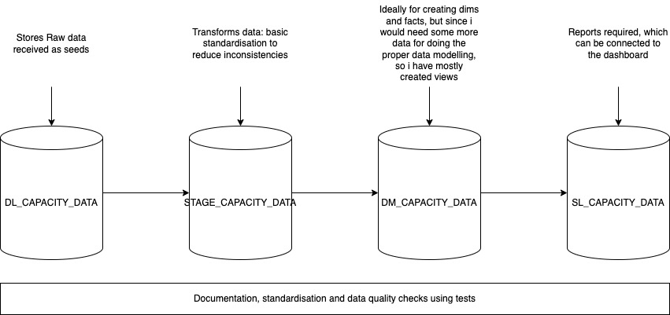

# Setting up environment on macos
Run the following command
```sh script.sh```
____
# DBT using postres database

1. I am assuming you have a postgres connection
2. I have setup a postgres on local host
3. Additionally I have created various schemas in order to differentiate between the stages of tranformation namely:

    - dl_capacity_data: stores the raw data in this layer
    - stage_capacity_data: will store the flattened structure or data with basic transformations
    - dl_capacity_data: will store facts and marts after modelling
    - sl_capacity_data: will store aggregated data


4. I have used the following sql code to achieve this, In future we can manage this using terraform:

`create schema stage_capacity_data;
create schema dm_capacity_data;
create schema sl_capacity_data;
create schema dl_capacity_data;`

___

## Populating data in Datalake

All the files that have been shared has been stored in the data lake layer using seeds from dbt, you can use the following command to run all seeds

    dbt seed --target dev --profiles-dir ../

___

## Populating data in Staging layer

Basic data cleanups, standardisation and fixing the timezone issues will be taken care of here

___

## Populating data in Datamarts

Ideally i would convert the data into dims and facts and i have a different plan for data models but for simplicity i am just converting them to views here and additionally creating the fact_dates here which is useful for me further

___


___

## Populating data in Reports

I am creating three reports in the reporting layer which we can use with the dashboards to reflect the information required

___

___

## Test for data quality


___


# High level picture of architetcure


